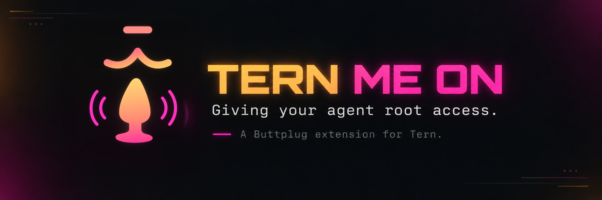
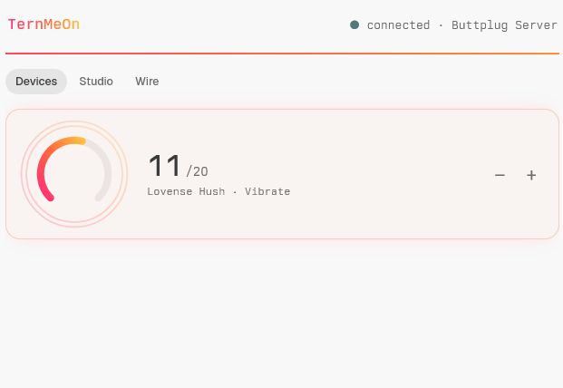
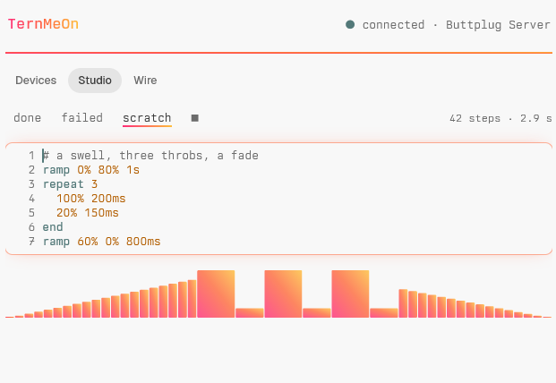
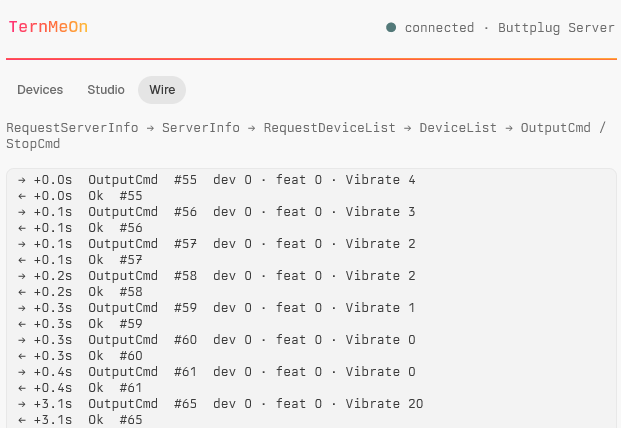
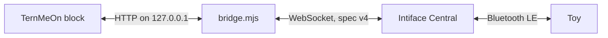
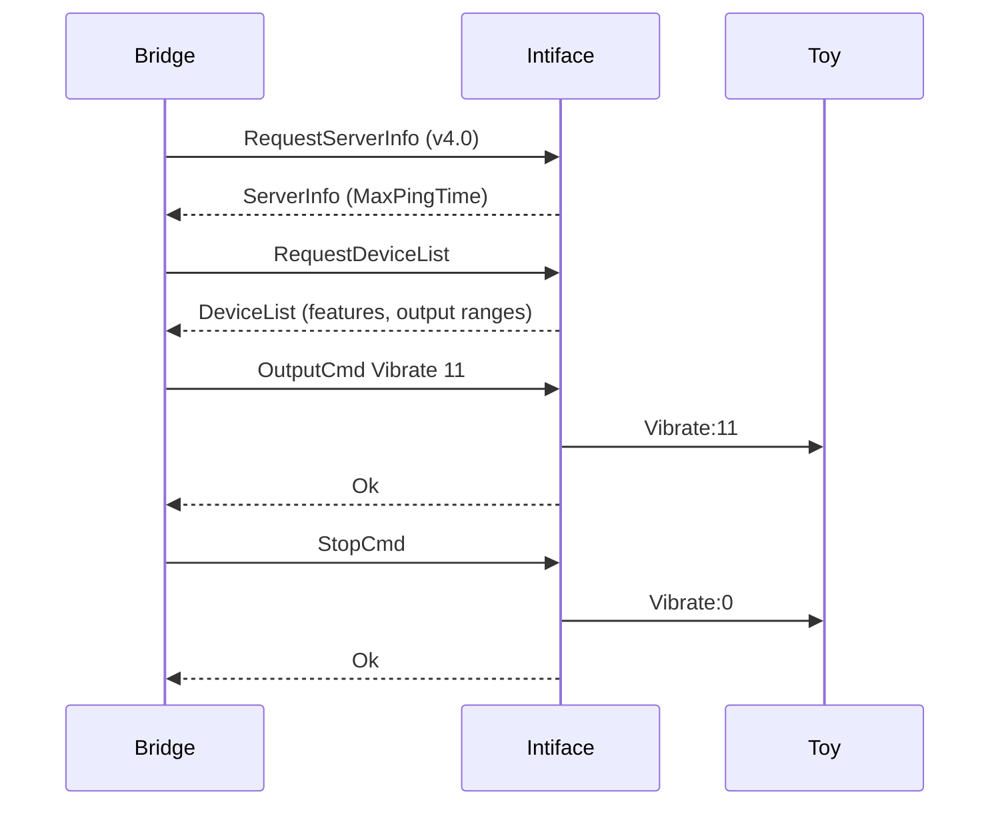

<p align="center">
  
</p>

<p align="center">
  Control <a href="https://buttplug.io/docs/spec">Buttplug</a> devices from the Tern terminal,<br>
  write haptic patterns as code, and feel your long commands finish.
</p>

<p align="center">
  
  
  
  
</p>

## Tour

<table>
  <tr>
    <td width="33%"></td>
    <td width="33%"></td>
    <td width="33%"></td>
  </tr>
  <tr>
    <td align="center"><b>Devices</b><br><sub>one calm arc per output</sub></td>
    <td align="center"><b>Studio</b><br><sub>patterns as code, live waveform</sub></td>
    <td align="center"><b>Wire</b><br><sub>the protocol, frame by frame</sub></td>
  </tr>
</table>

## Features

- **Devices.** Every output of every connected toy as a level arc with big numerals. Keyboard-first, and the mouse works too.
- **Studio.** Haptic patterns in a tiny language (`ramp`, `repeat`, `60% 200ms`), with highlighting, inline errors, undo, and a waveform preview.
- **Wire.** A live inspector of the Buttplug v4 messages the bridge sends and receives.
- **Buzz.** A command that runs longer than a threshold plays your `done` pattern when it succeeds and `failed` when it fails.
- **Panic chord.** <kbd>Ctrl</kbd>+<kbd>Alt</kbd>+<kbd>Shift</kbd>+<kbd>X</kbd> (<kbd>Cmd</kbd>+<kbd>Alt</kbd>+<kbd>Shift</kbd>+<kbd>X</kbd> on macOS) stops every device from anywhere in Tern.
- **Fails safe.** The bridge stops all devices and exits 20 s after the controls close or Tern goes away.

## Quick start

1. Start [Intiface Central](https://intiface.com/central) and press **Start Server**. It listens on `ws://127.0.0.1:12345`.
2. Have Node 22+ or Bun on the PATH of Tern's daemon.
3. Install the plugin:

   ```sh
   tern plugin install <path or github URL>
   # or load a clone in place, reloading on save:
   tern plugin link DIR
   ```

4. Run **Open TernMeOn controls** from the palette. The block starts the bridge and connects. Press <kbd>S</kbd> to scan for toys.

## Keys

The block is "TernMeOn Studio": a header with one muted status line (state, server name, scanning, last error), three tabs, and a dock with key hints. <kbd>Tab</kbd> / <kbd>Shift</kbd>+<kbd>Tab</kbd> switch tabs; clicking works too. <kbd>N</kbd> toggles buzz and <kbd>X</kbd> stops all devices from any tab.

**Devices**

| Key | Action |
| --- | --- |
| <kbd>↑</kbd> <kbd>↓</kbd> or <kbd>K</kbd> <kbd>J</kbd> | select an output |
| <kbd>←</kbd> <kbd>→</kbd>, <kbd>H</kbd> <kbd>L</kbd>, <kbd>-</kbd> <kbd>+</kbd> <kbd>=</kbd> | step down or up by 1/20 of the range (at least 1) |
| <kbd>0</kbd> to <kbd>9</kbd> | set the level to max × digit / 9 |
| <kbd>Space</kbd> | switch off, or back to the last value (or max) |
| <kbd>S</kbd> | start or stop scanning |

Without a connection the tab shows a one-line hint ("Start Intiface Central's server", "Press s to scan").

**Studio**

| Key | Action |
| --- | --- |
| <kbd>Enter</kbd> or <kbd>I</kbd> | edit the slot (or click the editor) |
| typing, <kbd>Backspace</kbd>, <kbd>Delete</kbd>, arrows, <kbd>Home</kbd>, <kbd>End</kbd> | edit; <kbd>Tab</kbd> inserts two spaces |
| <kbd>Ctrl</kbd>+<kbd>Z</kbd> / <kbd>Ctrl</kbd>+<kbd>Y</kbd> or <kbd>Ctrl</kbd>+<kbd>Shift</kbd>+<kbd>Z</kbd> | undo / redo (100 steps) |
| <kbd>Ctrl</kbd>+<kbd>Enter</kbd> | play the slot |
| <kbd>Ctrl</kbd>+<kbd>←</kbd> <kbd>→</kbd> | previous / next slot |
| <kbd>Esc</kbd> | stop devices and leave the editor (saves the slots) |

<kbd>Cmd</kbd> works in place of <kbd>Ctrl</kbd>. The slot row also has clickable slot names and a play / stop glyph.

## Pattern language

Three slots: `done` and `failed` (what the buzz plays) and `scratch`.

```text
# a swell, three throbs, a fade   # comments run to the end of the line
ramp 0% 80% 1s                    # glide between levels (2-20 steps)
repeat 3                          # repeat up to `end` (nests 4 deep)
  100% 200ms                      # hold a level; units ms or s
  20% 150ms
end
ramp 60% 0% 800ms
```

- **Limits.** A step lasts 10 ms to 10 s and a ramp 20 ms to 60 s. Expanded, a program is at most 256 steps and 60 s, in at most 400 lines of 200 bytes.
- **Text.** ASCII only. Keywords and units are case-insensitive.
- **Errors.** One per line, shown inline. Nothing plays while any error exists. The full list of failure modes is the comment at the top of `studio.luau`.
- **Defaults.** `done` is two 40 % pulses and `failed` one 100 % pulse of 700 ms. A slot that doesn't parse falls back to its default for the buzz.

## Wire

The newest 24 frames, one per line. <code>→</code> is client to server, <code>←</code> is server to client, and the time is seconds since the oldest frame shown. Pings are left out.

```text
→ +0.0s  RequestServerInfo  #1  v4.0
← +0.0s  ServerInfo  #1  Buttplug Server · ping 0
← +0.0s  DeviceList  1 device
→ +4.9s  OutputCmd  #69  dev 0 · feat 0 · Vibrate 11
← +4.9s  Ok  #69
→ +4.9s  StopCmd  #70
```

## How it works

Most toys are Bluetooth LE peripherals; a few use USB, serial, HID or a Lovense dongle. Every vendor speaks its own protocol. Lovense, for example, takes ASCII commands like `Vibrate:10;` on a TX characteristic and answers `DeviceType;` and `Battery;`.

Buttplug (BSD licensed, with a Rust reference implementation) puts all of them behind one JSON protocol. Intiface Central (desktop app) or Intiface Engine (command line) is the server: it owns the radios and listens on `ws://127.0.0.1:12345`.

Tern plugins run Luau and have only HTTP and child processes, no sockets. So the plugin starts `bridge/bridge.mjs` (Node 22+ or Bun, zero dependencies). The bridge holds the WebSocket and serves a token-guarded HTTP API on 127.0.0.1. It advertises its port and token in `bridge.json` in the plugin's data folder.



Spec v4 (January 2026) in one session:



The server sends the full `DeviceList` again on every change. Each feature lists its `Output` types (Vibrate, Rotate, Oscillate, Constrict, Position, HwPositionWithDuration) with integer `Value` ranges. `InputCmd` reads battery and RSSI. If the client misses the `Ping` deadline in `MaxPingTime` or disconnects, the server stops every device. The server also enforces each device's `DeviceMessageTimingGap`.

## Safety

- **Idle exit.** The bridge exits 20 s after its last authenticated request, and an open block polls `/state` every second. So closing the last block, or Tern dying, stops the polling. Before exiting, the bridge sends `StopCmd`. SIGINT, SIGTERM, SIGHUP and `/shutdown` take the same path.
- **Panic.** The panic chord and **Stop all devices** send `/stop` for every device.
- **No web access.** Requests with an `Origin` header are refused (403), so web pages can't reach the bridge. Every other request needs `X-TernMeOn-Token`, a random 48-hex token per run kept in `bridge.json` (401 otherwise). The bridge listens on 127.0.0.1 only.
- **Vibrate only.** Patterns (Studio, the buzz, `/pattern`) drive only `Vibrate` outputs and restore the previous values when they end. Any output command or `/stop` cancels a running pattern.
- **Neutral off.** "Off" is 0 clamped into the output's range. A two-way `Rotate` ([-20, 20]) therefore stops instead of spinning full speed backwards.

## Settings

Kept in the plugin's `kv.json`: `<state>/plugin-data/ternmeon/kv.json`, on Windows `%LOCALAPPDATA%\Tern\plugin-data\ternmeon\kv.json`.

| Key | Type | Default | Use |
| --- | --- | --- | --- |
| `node` | string | unset | runtime tried first to start the bridge (then `node`, then `bun`) |
| `server_url` | string | `ws://127.0.0.1:12345` | sent when a block attaches to a disconnected bridge |
| `notify` | boolean | off | buzz when a long command ends (<kbd>N</kbd>) |
| `notify_after_ms` | number | 10000 | buzz threshold |
| `patterns` | `{done, failed, scratch}` | defaults above | Studio slot texts; saved on play, on leaving the editor, and on slot or tab change |

The buzz only works while a TernMeOn block is open, since the open block is what keeps the bridge running.

<details>
<summary><b>Bridge API</b></summary>

Base `http://127.0.0.1:<port>`; the port and token are in `bridge.json`. Send `X-TernMeOn-Token`. Bodies are JSON objects of at most 64 KiB. Replies are `{ok, state}`, or `{ok: false, error, state}` on failure; 401 and 403 replies carry no `state`.

| Method and path | Body | Effect |
| --- | --- | --- |
| `GET /state` | | server, scanning, pattern, step (index of the playing step, else null), wire (last 40 frames `{dir, t, msg}`, pings removed), active, level, devices |
| `POST /connect` | `{url?}` (`ws://` or `wss://`) | connect; default `ws://127.0.0.1:12345` |
| `POST /scan` | `{on}` | start or stop scanning (connected only) |
| `POST /output` | `{device, feature, type, value}` | set one output, clamped; cancels a pattern |
| `POST /stop` | `{device?}` | `StopCmd` for one or all devices; values to 0; cancels a pattern |
| `POST /pattern` | `{steps: [[0..1, 10..10000 ms], ...]}` (1 to 256) | play on all Vibrate outputs, then restore |
| `POST /shutdown` | | stop devices and exit after the reply |

Errors: 400 bad input, 401 bad token, 403 `Origin` present, 404 unknown route or output, 409 not connected, 413 body too large, 502 server error or timeout, 500 anything else.

</details>

## Testing

There are no unit tests. The only test is one end-to-end run with nothing mocked. It drives a real Tern instance (with its own config, daemon and hidden window) against a real Intiface Engine and a fake Lovense toy, then checks the exact commands the toy receives.

```sh
node e2e/run.mjs                              # writes e2e/out/<timestamp>/
node e2e/run.mjs --verify e2e/out/<timestamp> # re-checks an artifact
```

Each artifact holds `report.json`, `summary.md`, screenshots, the toy's log and the engine log. See [`e2e/README.md`](e2e/README.md) for the steps and the failure modes the harness guards against.
