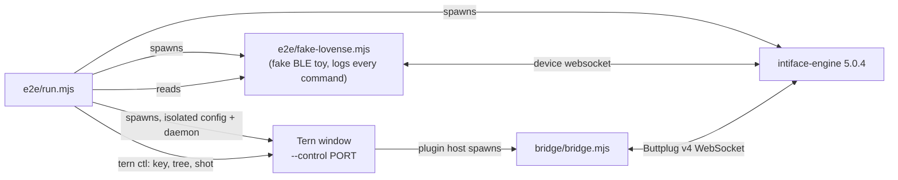

# TernMeOn end-to-end test

The only test of this repo. One command drives the real stack and leaves an
artifact behind:

```sh
node e2e/run.mjs [--engine PATH] [--smoke] [--theme light|dark] [--keep] [--out DIR]
node e2e/run.mjs --verify e2e/out/<timestamp>
```

`--smoke` runs only the flow steps marked `smoke` (open, connect, no handler
errors) plus setup and teardown; its artifact says so. `--keep` leaves the run
directory `e2e/.cache/run-<id>/` (config, plugin snapshot, logs) for
inspection. `--out DIR` changes the artifact base directory.



Nothing is mocked: the plugin runs inside a real Tern daemon, its bridge talks
Buttplug v4 to a real Intiface Engine, and the engine drives a fake Lovense toy
over its device-websocket server. The assertions are the toy's log (`Vibrate:N;`
exactly as the toy received it) and the text of Tern's element tree.

## Requirements

- Node 22+ (global `WebSocket`), the same the bridge needs.
- `tern` on `PATH`, signed in to the closed beta (`gate.signed_in` in
  `tern ctl state`). The sign-in lives outside `TERN_CONFIG_DIR` (it survives
  the isolation below), so the harness only checks it.
- Windows: PowerShell 7 (`pwsh`). Tern's shell integration, the source of the
  `command_finished` event behind the buzz feature, does not load in Windows
  PowerShell 5, so the isolated config sets `shell = pwsh`.
- Intiface Engine: `--engine PATH`, else `$INTIFACE_ENGINE`, else the pinned
  release zip (v5.0.4, SHA-256 checked) downloaded once into `e2e/.cache/`.
  Needs `tar` (Windows 10+, macOS) or `unzip` (Linux), and network access for
  the first run.
- A desktop session with a GPU. On Windows the Tern window is created hidden
  (`SW_HIDE`): it renders and takes screenshots but never appears or takes
  focus. Other platforms are unverified and would show it.

## Isolation

Each run has its own Tern: `TERN_CONFIG_DIR=e2e/.cache/run-<id>/cfg`,
`TERN_DAEMON_SOCKET` naming a pipe/socket of the run (the first window starts a
daemon there), its own window and `--control` port. Config and state move
together, so the run has its own `settings.json` and `plugin-data/ternmeon/`
(`kv.json`, `bridge.json`). The plugin is installed with `tern plugin install`
from a snapshot copy of the working tree. The user's real daemon, sessions,
settings, kv and bridge are never read or written (the harness holds no path
to them). Every `tern` child gets an environment scrubbed of `TERN_*`
(`TERN_PANE_SOCKET`, `TERN_WINDOW_KEY`, `TERN_IDENTITY`, ...), so running the
harness from inside a Tern pane cannot attach to that pane's daemon.

## Artifact

`e2e/out/<ISO timestamp>/` (colons written as dashes):

| File | Content |
| --- | --- |
| `report.json` | run metadata (mode, versions, ports, plugin snapshot SHA-256) and per step: `n`, `phase`, `name`, `status` (`pass`/`fail`/`skip`), `ms`, `evidence`, `error`, `shots`; plus the SHA-256 of every other file |
| `summary.md` | table of the steps with evidence excerpts, then the screenshots embedded |
| `screenshots/NN-name.png`, `.layout.json` | copied from Tern's shots directory; failing flow steps add `NN-fail-<step>` |
| `device.log` | every line the fake toy saw or sent: epoch ms, ISO time, kind (`open`/`rx`/`tx`/`close`), text |
| `engine.log` | Intiface Engine stdout and stderr |
| `tern-logs/` | Tern's own logs of the run: `tern.log` (window), `tern-daemon.log` (plugin host), `window.out` |
| `kv.json` | the plugin's kv at the end of the run |

Exit code 0 only if every step passed (a skipped step is not a pass).
`--verify DIR` recomputes the file hashes, checks the step counts and `passed`
against the steps and that every named screenshot exists; exit 0 only for an
intact artifact of a fully passing run.

## What a run does

Setup (a failing step skips the rest of setup and the flows; teardown still runs):

1. preflight: node, `tern`, the configured shell runs
2. engine: locate or download, `--version`
3. engine: start on free ports
4. fake toy: connects, and the engine asks it `DeviceType;` (the engine accepted it)
5. config: plugin snapshot installed, `settings.json` and `kv.json` written
6. tern: window up, signed in, isolated daemon found by its socket name
7. tern: isolation holds (`tern plugin dir` under the run, plugin `ready`, every pane is the run's)
8. plugin: `plugins run plugin.ternmeon.open`; block pane listed and focused; `bridge.json` appears
   (and did not exist before); the bridge answers `GET /state` with the token in it

Flows: the `FLOWS` list in `run.mjs`, then "the host logged no handler errors"
(a Luau runtime error in a view or key handler only shows in the daemon log, as
`plugin handler failed`).

Teardown:

1. arm the toy through the bridge API (`Vibrate:3;` seen by the toy), so the next checks mean something
2. `tern close` the block pane
3. `bridge.json` is gone and the bridge process exited within 30 s (the bridge's own 20 s idle exit)
4. the toy received `Vibrate:0;` after the close
5. `ctl quit`, window exits
6. kill daemon, engine, toy; no process with the run id in its command line is left

## Writing flows

All UI-specific steps are the `FLOWS` list at the top of `run.mjs`:

```js
{ name: 'key 5 raises the level to 5/9 of the range',
  ctl: ['@click .sf-main', 'key 5'],           // run in order, once
  expect: { tree: /11\/20/,                    // regex(es) on the text of `tree <sel>` (sel: step.sel, else TREE_SEL)
            fakeLog: [/^rx Vibrate:11;$/],     // ordered regexes on device.log lines written during this step
            noFakeLog: /^rx Vibrate:20;$/,     // must NOT appear (checked 700 ms after the rest holds)
            kv: { notify: true },              // fields of the plugin's kv.json
            lines: /Vibrate 11\n[\s\S]*StopCmd/, // regexes on the accessibility labels, one per line (not cut at 200 chars like `tree`)
            at: { '.tmo-dock': /play/ },       // regexes on another region (atNot: must not match)
            fn: ({ ctl, labels, blocks, bridge, toyLines }) => 'evidence' },  // truthy = holds; false or a throw = not yet
  shot: 'level',                               // `shot` once the expectations hold
  smoke: true,                                 // also part of --smoke
  midShot: { name: 'x', when: ({ bridge }) => ... }, // a shot taken the moment `when` holds, while the step runs
  timeout: 8000 }                              // the expectations are polled every 200 ms until then
```

`ctl` entries are `tern ctl` command lines passed verbatim (`key right`,
`type hello world`, `run "Start-Sleep 2"`, `tab 2`, `focus left`), plus:
`@click SEL` (click the centre of the first element matching SEL: DOM focus,
which decides where keys go), `@tern ARGS` (the tern CLI against the isolated
daemon, e.g. `@tern new tab -- pwsh`) and `@wait MS`. A new tab does not
become the shown tab by itself; follow `@tern new tab` with `tab N`.

## Failure modes

What can make this run flaky or wrong, and what the harness does about it.

| # | Failure mode | Handling |
| --- | --- | --- |
| 1 | Port clashes: another engine on 12345/23456, another Tern window's control port | The engine's websocket and device-websocket ports and the control endpoint are picked free per run (`listen(0)` on 127.0.0.1). An engine or window that dies while starting is retried (3x) on fresh ports. |
| 2 | Race between choosing and binding a port | Same retry; start steps wait until the ports accept connections, not for a fixed time. |
| 3 | Stale `bridge.json` (a dead or foreign bridge) taken for ours | The config is new per run, so no old file exists; the open step asserts the file is absent before the block opens, then checks its `pid` is alive and the token works on `GET /state`. Teardown asserts the file is gone and the pid exited. |
| 4 | The user's kv left changed, or kv of an earlier run leaking in | The user's `kv.json` is never touched: the test kv is written into the throwaway config before Tern starts. The run's kv is copied into the artifact. There is nothing to restore, so nothing to forget after a crash. |
| 5 | The user's real Tern sessions or panes touched | Own daemon (unique socket), config and window; `TERN_*` scrubbed from every child; `tern close` only receives ids read from the isolated `tern ls --json`. The isolation step asserts `tern plugin dir` is under the run and every pane is the run's. |
| 6 | Keys go to the wrong element: DOM focus decides, and `tern new tab` does not switch to the new tab | The open step asserts the block is the focused pane; flows use `@click SEL`, `focus left`, `tab N` and assert what is focused (`state.focused`) before typing. |
| 7 | Plugin edited while the run is under way (a linked plugin reloads on save and recreates its block under a new pane id) | The run installs a snapshot copy of the working tree (dotfiles, `e2e/`, `node_modules/`, `target/` left out); its SHA-256 is in the report. |
| 8 | Shell integration missing: Windows PowerShell 5 (the default shell) never reports `command_finished` (its integration script fails to parse there), and `ctl feed` cannot stand in for a shell on Windows (it restarts the pane under `stty`) | The isolated `settings.json` sets `shell = pwsh`, where the integration loads. The buzz flows run real commands in that shell and assert Tern's own record (`state.focused.last`) and the toy's log. Preflight fails if `pwsh` does not run. |
| 9 | Engine download fails, truncated, or another build | Pinned URL and SHA-256 per platform; written to `.part`, verified, renamed; a cached zip is re-verified, an extracted binary is reported with its SHA-256. `--engine`/`$INTIFACE_ENGINE` skip the download. No asset for the platform (macOS x64) is an explicit error. |
| 10 | Timing: the block polls the bridge once a second; devices appear a moment after `connected`; the window takes ~6 s to start; `run` returns before a command ends | No fixed sleeps in flows. Every expectation is polled (200 ms) to a per-step timeout (default 8 s). Keys are never retried: they are not idempotent. The window start polls `ctl state` for up to 60 s. |
| 11 | Comparing the toy's log to steps; the tail of one step's effect (a pattern's final restore) landing in the next step | Each step reads only the log lines written after its start (a line-count mark), never wall-clock windows, and starts only once the toy has been quiet for 500 ms and the bridge reports no pattern playing. |
| 12 | The toy loses the engine and never returns | The fake reconnects every 500 ms and announces itself again. |
| 13 | Leftover processes: engine, fake, window, isolated daemon, bridge | pids are recorded in `e2e/.cache/run-<id>/pids.json`. Cleanup runs in `finally`, on SIGINT/SIGTERM/SIGHUP/SIGBREAK and on `exit`: bridge `POST /shutdown`, `ctl quit`, then every process whose command line carries the run id is killed (the isolated daemon, which the harness did not spawn itself, and the bridge, which the daemon spawned, are found that way). The last teardown step asserts none is left. |
| 14 | The harness killed hard (no handlers run) | The next run reads every `run-*/pids.json` whose harness pid is dead, kills processes whose command line names that run, and removes its directory. |
| 15 | Leftover blocks: the plugin block lives in the daemon, not the window; closing the window leaves it and its bridge alive | Teardown closes the block pane, then asserts the bridge's own idle exit; the isolated daemon is killed afterwards. |
| 16 | The shutdown check passes trivially because the toy was already at 0 | Teardown first arms the toy through the bridge API and asserts it received a non-zero level. |
| 17 | Locale: OS error texts are localized (Polish here) | Nothing matches on OS error text, only exit codes and the JSON `ok` field of `ctl` replies. |
| 18 | `ctl` re-splits arguments on whitespace and honours embedded quotes, so a shell-style `"a b"` would be wrong | Each command is passed as one argument, verbatim; flows write `tree .sf-main` and `run "two words"` with no shell layer in between. |
| 19 | Screenshot path depends on the window's cwd and DPI | The window has its own cwd (`run-<id>/cwd`); the path comes from the `shot` reply. Screenshots are evidence, never compared pixel by pixel. |
| 20 | A crash leaves no artifact | The artifact directory exists from the start; `report.json` and `summary.md` are rewritten after every step, and on a signal. |
| 21 | Closed-beta gate not signed in | The window step fails with the gate state if `gate.applies` and not `gate.signed_in`. |
| 22 | Old Node (no global `WebSocket`) | Exits 2 with the version before doing anything. |
| 23 | A Luau error in the plugin's view or key handler: the block just renders nothing, nothing else fails | Failing expectations append the plugin's `plugin handler failed` lines from the daemon log; a dedicated step fails on any WARN/ERROR line about the plugin. |
| 24 | A window flashing up and stealing focus on the user's desktop | Created hidden on Windows (verified: no window handle, `IsWindowVisible` false, `shot` and `ctl` still work). |
| 25 | Two harness runs at once | Distinct ports, config, pipe and run id; each cleanup and the orphan check match only their own id; a run still starting is not swept. |

## Known limits

- Only Windows is exercised. The POSIX branches (process listing, kill, engine
  extraction with `unzip`, socket path) are written but not run anywhere yet.
- The fake toy is a Lovense Hush over the engine's websocket device manager; no
  Bluetooth, USB or other protocol is covered. The engine is started without
  its BLE and serial flags, so no real device is involved.
- Screenshots show the redesigned UI as it is; nothing asserts their pixels.
- `FLOWS` cover Devices, Studio (editing, errors, slots, play), Wire (handshake,
  frame format, OutputCmd values against the toy) and the buzz hook. `tree`
  cuts an element's text at about 200 characters, so long content (the wire
  frames) is asserted on the accessibility labels (`lines`).
- `--theme dark|light` writes the theme into the isolated settings; use it
  with `--smoke` for a themed shot (the isolated default is light).
